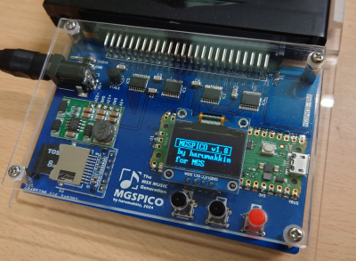

# MGSPICO
2025/05/25 harumakkin

 **fig.1 MGSPICO**

## これは何？
MSX本体が無くてもFM音源カートリッジと[MGSDRV](https://gigamix.jp/mgsdrv/)を使用してMGS楽曲データを再生し鑑賞できる個人製作のハードウェアです。MGSDRV は Raspberry Pi Pico内で動作しますが、RP2040用に移植したものではなく、MSX用のMGSDRVを [HopStepZ](https://github.com/cliffgraph/HopStepZ) というMGSDRV専用エミュレータを使用して動作させています。
また、ファームウェアver1.2から、[勤労五号(KINROU5.DRV)](https://sakuramail.net/fswold/music.html#muskin)というMuSICA上位互換ドライバも使用することでMuSICA楽曲データも再生できるようになりました。
さらに、ファームウェアver1.14から、[NDP - PSG Driver for MSX](https://ndp.squares.net/web/)も使用できるようになりNDP楽曲データも再生できるようになりました。
MuSICA/NDPデータを再生することができるようになっても名前はMGSPICOのままです。ご容赦を。
ファームウェアver1.9からはVGMファイルにも対応しています。

## 使い方
### 用意するもの
- MGSPICO
- [MGSDRV.COM(Ver3.20)](https://gigamix.jp/mgsdrv/)
- MGS楽曲データファイル（.MGSファイル）
- [KINROU5.DRV(Ver2.00)](https://sakuramail.net/fswold/music.html#muskin)
- MuSICA楽曲データファイル（.BGMファイル）
- [NDP.BIN(Ver1.03)](https://ndp.squares.net/web/)
- NDP楽曲データファイル（.NDPファイル）
- microSD カード
- FM音源カートリッジ
- SCC音源カートリッジ
- DC5V電源(microUSB、もしくは、センタープラス 2.1mm DCプラグ）

#### 動作確認済みFM音源/SCC音源カートリッジ
|カテゴリ|カートリッジ|備考|
|:-|:-|:-|
|PSG/OPLL|[SoundCoreSLOT EX](http://niga2.sytes.net/sp/coreslot.pdf)||
|PSG/OPLL|[MSX SOUND ENHANCER](https://www.kadenken.com/view/item/000000001175)||
|SCC|MSX2版 スナッチャー 付属SCCカートリッジ|MGS/MuSICA供にOK|
|SCC|MSX版 SALAMANDER カートリッジ|MGS/MuSICA供にOK|
|PSG/SCC|YAMANOOTO|MGS/MuSICA/NDP供にPSGの再生はOK。SCCの再生が正しく行えません|
|MIDI|[MIDI PAC v2](https://shop.supersoniqs.com/)|MGSPICO-03C以前の基板では[MSX Slot Expander](https://www.8bits4ever.net/product-page/msx-slot-expander)経由で使用するか、改造（抵抗を一つ付ける）が必要です|

## microSD カードの準備
- microSDカードを用意します。（32GBの容量の物で動作確認しています、それ以外では行っていません）
- microSDカードを、FAT、もしくは、FAT32フォーマットを施します。
- microSDカードに、MGSDRV.COM、player.com をコピーします
また、MuSICAデータも鑑賞したい場合は、KINROU5.DRV、playerK.comもコピーします
- 鑑賞したいMGSデータファイル(.MGS)、MuSICAデータファイル(.BGM)もカードへコピーします（1000ファイルまで）

## セットアップする
- microSDカードをMGSPICOのスロットに取り付ける
- FM音源／SCC音源を取り付ける
- AudioOutにスピーカーなどを取り付ける
- MGSPICO に電源を取り付ける。microUSB or DCプラグ（電圧と極性を間違わないこと！）

 **fig.2 セットアップ例**

## 操作方法
**注意**：MGSとMuSICAは同時に使用できません。●ボタンを押しながら電源をONするとMuSICAモードで起動します。何もせず電源をONするとMGSモードで起動します
- STEP1. 電源を入れます
- STEP2. ディスプレイにMGSPICOのタイトルと、"for MGS" もしくは、"for MuSICA"が表示されます。
- STEP3. FM音源／SCC音源を認識できれば、音符マークと、SCCマークが表示されます
すぐにmicroSD内の最大3つの楽曲ファイルのファイル名が表示されます
- STEP4. ▲／▼ ボタンでファイルを選択できます
- STEP5. ● ボタンで、再生を開始します、同じファイルを選択した状態でもう一度押すと再生を停止します

## トラブルシュート
1. "Not found MGSDRV.COM"、と表示される。この場合は次のことが考えられます
	- microSDカードが正しく挿入されていない。フォーマットし直しや、容量を変更を個なってみてください
	- microSDカードにMGSDRV.COM が正しく格納されていない。格納されているか確認してください
2. "Not found KINROU5.DRV"、と表示される。この場合は次のことが考えられます
	- microSDカードが正しく挿入されていない。フォーマットし直しや、容量を変更を個なってみてください
	- microSDカードにKINROU5.DRV が正しく格納されていない。格納されているか確認してください
3. MSX SOUND ENHANCERとSCCを組み合わせるて使用するケースでFM音源が鳴らない
	- MGSPICOの電源をSW2を押しながら入れると解決します（ファイルリストが表示されるまでの１秒間押します）
	- MSX SOUND ENHANCERはFM音源認識用ダミーROMを持っていますが、SCCカートリッジをパススルースロットで使用するためにこのROMを切り離す設定にしているかと思います。そのためMGSDRVがFM-BIOSを認識できずFM音源のデータを再生しません。MGSPICOの電源をSW2を押しながら入れるとMGSPICOが持つFM音源認識用ダミーROMと同じことをMGSDRVに対して行いますので、MGSDRVがFM音源があるものとして動作します。

## ガーバーデータと部品表
- MGS-PICO-XXX/ ディレクトリ内を参照のこと。はんだ付けの難度は高いです。
- raspberry Pi Picoにインストールするファイルは、RasPiPico/dist/mgspico.uf2 です

# LICENSEと利用に関する注意事項
1. MGSPICOのファームウェアとそのソースコード、回路図データおよび資料ファイルは MIT License で配布されます。ただし、MGSPICO は、FatFsと8x16文字フォントを使用しています。FatFs/8x16文字フォントのソースコードの扱いに関しては各々のLICENSEに従ってください。
2. 本作品は同人ハードウェア＆ソフトウェアです。本作品の設計およびソフトウェアは品質を保証していません。音源カートリッジや音響設備、その周辺機器が故障、破損したとしても自身で責任を負える方のみ本作品をご利用ください。特にハードウェアの製作を伴いますのでリスクがあります。製作の腕に自身のある方のみご利用ください。
3. 本作品の設計資料とソースコードの改変や改造、また、別の作品への利用、商用利用は自由です。ただし、1. 2.の制限を超える利用は各自でその責任と義務を負ってください。

### MGSPICOが組込利用しているソフトウェア(PICO-SDK以外)
- FatFs Copyright (C) 20xx, ChaN, all right reserved. http://elm-chan.org/fsw/ff/00index_e.html
- 8x16 文字フォント FONT8X16MIN.h https://github.com/askn37/OLED_SSD1306
### 起動時に読み込んで使用しているソフトウェア
- MGSDRV
(C) Ain./Gigamix https://gigamix.jp/mgsdrv/
- 勤労５号（MuSICA互換ドライバ）
(C) 1996,1997 Keiichi Kuroda / BTO(MuSICA Laboratory) All rights reserved. https://sakuramail.net/fswold/music.html#muskin
- NDP (PSG Driver for MSX)
Programmed by naruto2413 https://ndp.squares.net/web/

## 修正履歴
|date|MGSPICO|firmware|note|
|:--|:--|:--|:--|
|2025/05/25|－|mgspico.uf2(v1.14)|NDP音源ドライバに対応しました。NDP楽曲データファイルは.NDP拡張子をつけてください  players.com、playersk.com は必要なくなりました。SDカードから players.com、playersk.com を削除してかまいません|
|2024/09/01|－|mgspico.uf2(v1.13)|スイッチ入力の反応が悪くなることがあるので、チャタリング対策を変更して改善した|
|2024/07/23|－|mgspico.uf2(v1.12)|一部のVGMファイルはSCC音源チップのパラメータを初期化せず楽曲が始まるデータがあり、前に再生した曲データによって聴こえ方が変わってしまうことがある。VGM(TGF)の再生前にSCC音源チップのすべてのパラメータを0クリアするようにした|
|2024/07/02|－|mgspico.uf2(v1.10)|VGMファイル再生に関する以下の不具合を修正しました ・0x66(end of sound data)以降にもデータが付加されているファイルでは正しく再生できなくなる。 ・0x7f(wait 15+1 samples)が使用されていると再生が停止してしまう、など|
|2024/07/01|－|mgspico.uf2(v1.9)|VGMファイルの再生に対応しました。SDカードにVGMファイルを入れ、SETTINGでVGMを選択してください。 VGMフォーマットのコマンド0x51(YM2413)、0xa0(PSG)、0xd2(SCC)に対応しています。それ以外の音源構成、例えばPSG2個などには対応していません。また、LOOPコマンドにも対応していないので曲が終わると曲の先頭に戻ります。有志の方々が公開しているMGSデータを数曲、[MSXplay](https://msxplay.com/index.html)でエクスポートして生成したVGMファイルのみ確認を行っています。|
|2024/06/24|－|mgspico.uf2(v1.8)|[●]を押しながら電源を入れるとSETTING（動作設定メニュー画面）を行うモードで起動します (1)再生データファイル形式の選択（music: MGS、MuSICA、TGF） (2)CPUクロックの選択(clock: 125MHz、240MHz） (3)自動再生(auto run: ON,OFF) (4)シャッフル再生(shuffle: ON,OFF） (5)音源ドライバにOPLLを強制認識させる(enf.OPLL: ON,OFF) 設定内容はSDカードに"mgspico.dat"という名前で保存され、次回電源ON時に設定内容が使用されます  **fig. SETTINGS** 注意：MGSPICOで使用しているRaspberryPiPicoのデフォルトのCPUクロックは125MHzです。240MHzへ切り替えることによって部品の寿命が縮まるなどの弊害があるかもしれません。テンポが遅くなる音楽データを再生するときに限定して、240MHzを使用することをお勧めします|
|－|－|mgspico.uf2(v1.7)|（欠番）|
|2024/05/??|－|mgspico.uf2(v1.6)|TGF形式の再生をサポート。TGFはharumakkin独自のデータファイルフォーマットなので気にしないでください|
|2024/04/27|－|mgspico.uf2(v1.5)|- ランダム再生機能を追加した。演奏中に [▲][▼]ボタンを同時に押す度にランダム再生機能はON/OFFする。 - ファイルリスト表示中の[▲]、[▼]ボタンのリピート動作を追加した。  - Thanks! dproldan, and Aquijacks.|
|2024/03/17|－|mgspico.uf2(v1.4)|- 順次再生する機能を追加した。一曲２回ループ演奏したら３回目の冒頭でフェードアウトして次の曲に移るようにした、ループせずに曲の最後に消音する曲に対しては強制的に次の曲に移るようにした。従来の同じを繰り返し再生はできなくなった。**同時に公開しているmgspico.uf2と、PLAYER.COMと、PLAYERK.COMを必ず組み合わせて使用すること。異なる世代のものを混在させないように注意すること**  - 起動時の/RESET信号の期間が長くなるようにした(For FlashJacks)  - YAMANOOTO カートリッジ の PSGを有効化する処理を追加した(For YAMANOOTO )。|
|2024/03/17|MGSPICO-04A|－|MIDI PAC v2との組み合わせではMIDI PACが動作しない問題を解決した。MGSPICO-03C基板と異なり、カードエッジスロットの9番ピン(/M1端子)を10kΩ抵抗で3.3Vにプルアップする回路が追加になっている。※MGSPICO-03C基板をすでに製造された方も抵抗器（10kΩ、1/4w程度）を用意いただき抵抗器の片足を9番ピン(/M1端子)へ、もう片方の足を3.3Vにハンダ付け改造していただければMGSPICO-04A基板と同等になります。m(__)m|
|－|MGSPICO-03E|－|（試験用に製作したもので、最終的に欠番とした）|
|－|MGSPICO-03D|－|（試験用に製作したもので、最終的に欠番とした）|
|2024/02/25|－|mgspico.uf2(v1.3)|MGSモードで一部の曲のPSGの音が正しくない問題を修正した。ただし対症療法であり、今後も再発の可能性がある|
|2024/02/24|－|mgspico.uf2(v1.2)|MuSICA互換ドライバを使用してMuSICAデータファイルも再生できるようにした。MuSICAデータ再生中のレベルインジケータ表示のために、KINROU5.DRVのワークアエリアの一部を公開いただきました作者様（@yarinige.bsky.social）と、仲介いただいたMSX Club Gigamix主宰(@nf-ban.gigamix.jp) 様に感謝申し上げます|
|2024/02/17|:--|mgspico.uf2(v1.1)|起動時に検出した音源をロゴで表示するようにした。また再生中は再生時間を表示するようにした。そのほかリファクタリング。|
|2024/02/15|MGSPICO-03C|－|ガーバーデータを修正した（microSDとスペーサーの位置が干渉してしまうので、microSDスロットの位置を少し移動した。機能に変更なし）。|
|2024/02/11|MGSPICO-03B|－|初公開|

## 余禄
MGSPICOの機能に関係ないですが、開発中に見つけたものをメモ書きしておきます。
##### SoundCoreSLOT EXとMSX SOUND ENHANCERの違い
- SoundCoreSLOT EXへは、CLOCK信号を供給しなくても鳴ります。自前のクリスタルを内蔵しているようです。ただしFMPACKと同様±12Vの供給は必要です。MSX SOUND ENHANCERはCLOCK信号の供給は必須ですが、±12Vは必要ありません。音質へのこだわりなのだと思うのですが二者のアプローチの違いが面白いです。
##### 1usもしくは数100ns単位のwait時間の作り方
- pico-sdkの busy_wait_usは、最小単位の1usを指定すると実際のwait時間が1usだったりそれよりも長かったりして不安定になります。sleep_usは繰り返し使用すると全体が停止してしまうことがありました（ほか処理との組み合わせなども絡んでいるとは思います)。なので、アドレスバス、データバスの制御では、nop命令をforループで繰り返す古典的な手法で1us、および数100ns単位のwait期間を作り出すようにしました。繰り返し回数は実測で決めましたので、今後コンパイラやsdkが更新される度に再調整が必要になるのかもしれません。
##### MGSDRVでの曲の終わりの判定方法
- mgspico.uf2はv1.4から、曲データを順次再生することができるように成りました。公開されている曲データはゲームBGMが多く、繰り返し再生する用途の曲が多いので、曲データの切り替えは２回再生したら、という条件で行っています。曲の終わりからまた初めから聞くことも多い曲が多いので２回は再生したいという思いです。KINROU5には再生回数を返すAPI(PLYCHK)が、MGSDRVの場合はワークエリア(LOOPCT)から現在何回目かを知ることができます。（一度目の再生中KINROU5のPLYCHKでは 1 が得られますが、MGSDRVのLOOPCTからは 0 が得られるという違いがありますが）
- ところが、作者の意向だと思うのですが、曲データによってはループせずに曲の終わりで消音して止まってしまうものがあります。この判断方法がわかりませんでした。[MGSP2](https://hra1129.github.io/software/mgsp_body.html)の[ソースコード](https://github.com/hra1129/mgsp2)を参考にさせてもらったのですがそれでも上手く判定できませんでした。仕方ないのでMGSPICOでは１７トラックのワークエリアを常に監視し、どのトラックもKeyOn/Offされない期間が2.5秒続いたら、曲は終了していると判断する、というようにしました。
##### VGM対応
- VGMフォーマットの仕様書そのものは[VGM Specification](https://vgmrips.net/wiki/VGM_Specification)を参照させていただきました。
- また[てつーん(@tettoon)](https://twitter.com/tettoon)さんの[VGM / S98 Player for RasPi to RE Module Interface (C Language Version)](https://github.com/tettoon/)もプログラミングの参考にさせていただきました。
- ただSCCの対応方法が判らなかったため、MSXPlayがエキスポートするVGMファイルの参考に実装しました。

##### その他
- ~~MGSPICOのRaspberryPiPicoはCPUのクロックアップを行っていません。mgspico.uf2ファームウェアは標準の125MHzのままで動作しています。~~（SETTINGで240MHzで動作させることができます）

